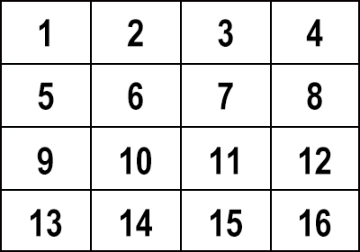
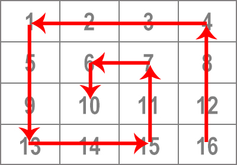

가로 세로 각각 N개의 칸을 가진 격자가 있습니다.

각 칸에는 아래와 같이 위에서부터 차례대로 번호를 매깁니다. (N=4일 경우의 예)

이제 가장 우하단의 칸인 16부터 시작하여 반시계방향으로 감아 들어가는 나선 모양으로 각 칸을 방문한다고 하면,

다음과 같은 순서가 됩니다.

16, 12, 8, 4, 3, 2, 1, 5, 9, 13, 14, 15, 11, 7, 6, 10

**[문제]** 사용자로부터 N 값을 입력받아서, N x N 격자의 칸들을 위와 같은 순서로 방문한 결과를 출력하는 프로그램을 작성하세요. (단, N은 1부터 100 사이의 자연수)

※ 프로그래밍 언어는 자유롭게 선택하셔도 좋습니다. 다만, 외부 라이브러리는 사용하지 마세요.
