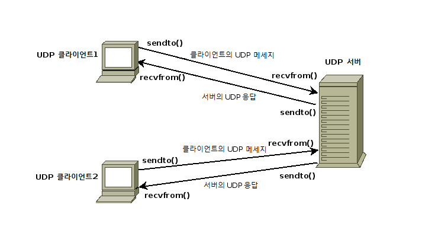

출처 : [https://pythontic.com/modules/socket/udp-client-server-example](https://pythontic.com/modules/socket/udp-client-server-example)

# UDP - 파이썬에서 클라이언트 서버 예제 프로그램

## UDP 개요

UDP는 User Datagram Protocol의 약어입니다. UDP는 TCP/IP 슈트의 인터넷 프로토콜을 사용합니다. UDP를 사용한 통신에서 클라이언트 프로그램은 메시지 패킷을 대상 서버로 전송하며 대상 서버도 UDP에서 실행됩니다.



## UDP의 속성 

* UDP는 메시지 패킷 전달을 보장하지 않습니다. 네트워크에서 일부 문제가 발생하면 패킷이 손실되면 영원히 손실될 수 있습니다.
* 확실한 메시지 전달을 보장할 수 없으므로 UDP는 신뢰할 수 없는 프로토콜로 간주됩니다.
* UDP를 구현하는 기본 메커니즘에는 연결 기반 통신이 필요하지 않습니다. UDP 서버 또는 UDP 클라이언트 간에 데이터 스트리밍이 없습니다.
* UDP 클라이언트는 "n"개의 별개의 패킷을 UDP 서버로 보낼 수 있으며 UDP 서버의 응답으로 "n"개의 별개의 패킷을 수신할 수도 있습니다.
* UDP는 비 연결 프로토콜이므로 UDP와 관련된 오버 헤드는 TCP와 같은 연결 기반 프로토콜에 비해 적습니다.


## 예시: 파이썬을 사용한 UDP 서버

```python
import socket

localIP     = "127.0.0.1"
localPort   = 20001
bufferSize  = 1024

msgFromServer       = "Hello UDP Client"
bytesToSend         = str.encode(msgFromServer)

# 데이터그램 소켓을 생성
UDPServerSocket = socket.socket(family=socket.AF_INET, type=socket.SOCK_DGRAM)

# 주소와 IP로 Bind
UDPServerSocket.bind((localIP, localPort))

print("UDP server up and listening")

# 들어오는 데이터그램 Listen
while(True):
    bytesAddressPair = UDPServerSocket.recvfrom(bufferSize)
    message = bytesAddressPair[0]
    address = bytesAddressPair[1]

    clientMsg = "Message from Client:{}".format(message)
    clientIP  = "Client IP Address:{}".format(address)
    
    print(clientMsg)
    print(clientIP)

    # Sending a reply to client
    UDPServerSocket.sendto(bytesToSend, address)
```

## 출력:

```
UDP server up and listening
Message from Client:b"Hello UDP Server"
Client IP Address:("127.0.0.1", 51696)
```

## 예시: 파이썬을 사용한 UDP 클라이언트

```python
import socket

msgFromClient       = "Hello UDP Server"
bytesToSend         = str.encode(msgFromClient)
serverAddressPort   = ("127.0.0.1", 20001)
bufferSize          = 1024

# 클라이언트 쪽에서 UDP 소켓 생성
UDPClientSocket = socket.socket(family=socket.AF_INET, type=socket.SOCK_DGRAM)

# 생성된 UDP 소켓을 사용하여 서버로 전송
UDPClientSocket.sendto(bytesToSend, serverAddressPort)

msgFromServer = UDPClientSocket.recvfrom(bufferSize)

msg = "Message from Server {}".format(msgFromServer[0])
print(msg)
```

## 출력:
 
```
Message from Server b"Hello UDP Client"
```
