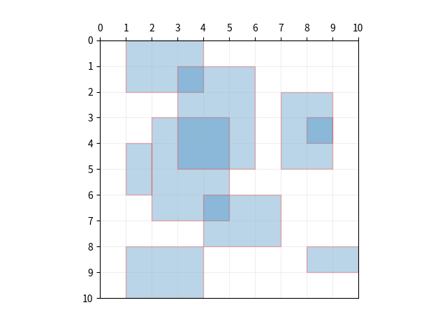

# 퀴즈

### *채용퀴즈를 풀어서 함께 제출해주셔야 접수가 이루어집니다.

## 문제

1920×1080 픽셀을 가진 Full HD 화면상에 수직선,수평선으로만 이루어진 직사각형들이 놓여 있습니다.  
이 직사각형들은 홀로 떨어져 있거나, 일부 겹치거나, 변 또는 꼭지점이 접하거나, 포함관계에 있을 수 있습니다.  
이 직사각형들이 차지하고 있는 총면적을 구하는 프로그램을 작성해서 보내주세요.  
프로그래밍 언어는 가장 자신있는 것을 사용하세요.

예로 10×10 픽셀을 가진 화면상에 아래와 같은 직사각형들이 있을 수 있습니다.



## 입력

각각의 사각형이 하나의 입력줄이 되며, 각 줄은 직사각형의 위치를 나타내는 네 개의 정수로 주어집니다.  
좌표는 왼쪽 위가 (0,0)이고 오른쪽 아래가 (1920, 1080) 입니다.  
첫 두 정수는 사각형의 왼쪽 위 꼭지점의 x, y좌표이고 다음 두 정수는 오른쪽 아래 꼭지점의 x, y좌표입니다.

위 예는 아래와 같은 입력을 갖습니다. 입력은 별도 파일에서 읽어와도 되고 소스코드안에 포함시켜도 됩니다.

_1 0 4 2_  
_8 3 9 4_  
_2 3 5 7_  
_4 6 7 8_  
_3 1 6 5_  
_1 8 4 10_  
_7 2 9 5_  
_8 8 10 9_  
_1 4 2 6_

## 출력

화면에서 직사각형들이 차지하고 있는 총면적을 출력합니다.

위 예의 출력은 다음과 같습니다.

_46_

## 의존성 관리

```shell
recruit]$ pip install -r requirements.txt
```

## 프로그램 실행

```shell
recruit]$ python rectangle.py
```
